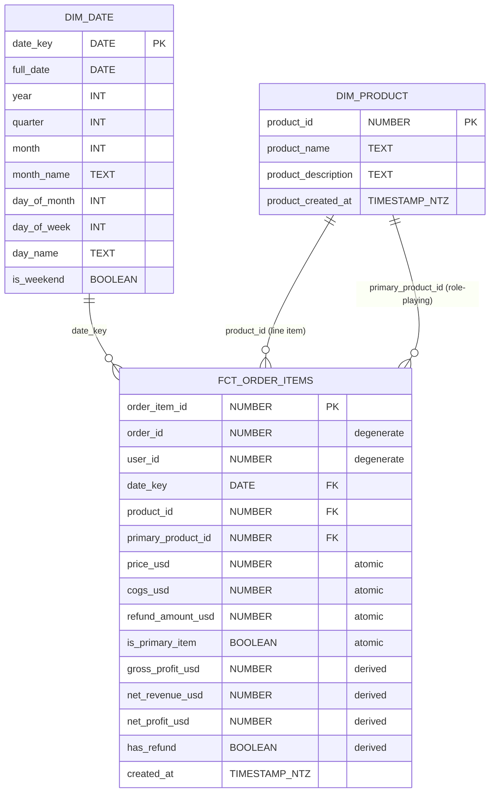

# Star Schema Design: Basket Craft Merchandising

**Date:** 2026-04-26
**Status:** Approved (brainstorming phase). Ready for implementation planning.

## Stakeholder

Maya, head of merchandising at Basket Craft. She uses analytics to decide what to promote, what to bundle, and what to discontinue. The schema needs to answer her merchandising questions directly, without dragging her through orders, users, or session tables she doesn't need.

## Question Themes in Scope

Three of the four merchandising themes:

- **A. Product performance and trends** — revenue, order count, units sold, sliced by product and time.
- **B. Bundling and basket analysis** — which products are bought together; primary vs. secondary item analysis.
- **D. Margin and net revenue** — gross profit (price − COGS), net revenue (price − refunds), product-level refund rates.

**Out of scope:** customer cohorts, acquisition channels, browse-to-buy conversion. Adding these would expand the schema with user and session dimensions. Defer until Maya asks.

## Architecture

Five layers from source to consumer:

1. **RDS Postgres** (existing) — `raw.*` tables loaded from MySQL.
2. **Snowflake `RAW`** (existing) — copied via `load_rds_to_snowflake.py`.
3. **dbt staging** (existing) — `stg_*` views over `RAW` with type casts and PII drops.
4. **dbt intermediate** (NEW) — `int_order_items_with_refunds` view that holds the refund `LEFT JOIN` plus `SUM`.
5. **dbt marts** (NEW) — `dim_product`, `dim_date`, `fct_order_items` tables. Maya queries these.

### Materialization

- Staging and intermediate: views (cheap to rebuild).
- Marts (dim and fct): tables (Maya's query latency matters).

### Repo Layout

```
dbt/models/
├── staging/                                     (existing, 8 stg_* views)
├── intermediate/                                (NEW)
│   └── int_order_items_with_refunds.sql
└── marts/
    ├── dim_product.sql                          (NEW)
    ├── dim_date.sql                             (NEW)
    ├── fct_order_items.sql                      (NEW)
    ├── _marts.yml                               (NEW)
    └── monthly_sales_summary.sql                (existing, to deprecate)
```

## Grain

`fct_order_items` is at **order line-item grain** — one row per `order_item_id`. This is the finest grain available, and it supports all three themes:

- **A** (product trends): aggregate up to product × month.
- **B** (bundling): group by `order_id` to see what's in a basket.
- **D** (refunds): refunds happen at line-item level and join cleanly.

Going coarser (order header, daily snapshot) would lose information that B and D need.

## ERD

`dim_product` plays two roles: it joins to the fact once for the line item's product and again for the order's headline product. That's the same dim joined twice, which is why both `product_id` and `primary_product_id` appear with arrows pointing at it.



## Components

### dim_product

**Materialization:** table
**Source:** `stg_products`

| Column | Notes |
|---|---|
| `product_id` | primary key |
| `product_name` | |
| `product_description` | |
| `product_created_at` | renamed from `created_at` to avoid clashing with the fact's column of the same name |

SCD Type 1 — current attributes only, no history. Approximately 4 rows.

### dim_date

**Materialization:** table
**Source:** generated from `GENERATOR(ROWCOUNT => 11000)` plus `DATEADD(day, SEQ4(), '2010-01-01'::date)`. Covers ~30 years through 2040.

| Column | Notes |
|---|---|
| `date_key` | primary key, type `DATE` |
| `full_date` | duplicate of `date_key`, kept for query readability |
| `year`, `quarter`, `month` | integer parts |
| `month_name`, `day_name` | text parts |
| `day_of_month`, `day_of_week` | integer parts |
| `is_weekend` | boolean |

Approximately 11,000 rows. Conformed dimension that any future fact can reuse.

### int_order_items_with_refunds

**Materialization:** view
**Source:** `stg_order_items` `LEFT JOIN` aggregated `stg_order_item_refunds`

```sql
with refunds_per_item as (
    select
        order_item_id,
        sum(refund_amount_usd) as refund_amount_usd
    from {{ ref('stg_order_item_refunds') }}
    group by order_item_id
)

select
    oi.order_item_id,
    oi.order_id,
    oi.product_id,
    oi.is_primary_item,
    oi.price_usd,
    oi.cogs_usd,
    coalesce(r.refund_amount_usd, 0)::numeric(12, 2) as refund_amount_usd,
    oi.created_at
from {{ ref('stg_order_items') }} oi
left join refunds_per_item r
    on oi.order_item_id = r.order_item_id
```

Same row count as `stg_order_items`. The `LEFT JOIN` preserves items that have no refund.

### fct_order_items

**Materialization:** table
**Source:** `int_order_items_with_refunds` `INNER JOIN` `stg_orders`

```sql
with order_context as (
    select
        order_id,
        primary_product_id,
        user_id
    from {{ ref('stg_orders') }}
)

select
    -- Degenerate dimensions
    oi.order_item_id,
    oi.order_id,
    o.user_id,

    -- Foreign keys to dimensions
    oi.created_at::date as date_key,
    oi.product_id,
    o.primary_product_id,

    -- Atomic measures
    oi.price_usd,
    oi.cogs_usd,
    oi.refund_amount_usd,
    oi.is_primary_item,

    -- Derived measures
    (oi.price_usd - oi.cogs_usd)::numeric(12, 2) as gross_profit_usd,
    (oi.price_usd - oi.refund_amount_usd)::numeric(12, 2) as net_revenue_usd,
    (oi.price_usd - oi.cogs_usd - oi.refund_amount_usd)::numeric(12, 2) as net_profit_usd,
    oi.refund_amount_usd > 0 as has_refund,

    -- Timestamp
    oi.created_at
from {{ ref('int_order_items_with_refunds') }} oi
inner join order_context o on oi.order_id = o.order_id
```

`product_id` references `dim_product` for the line item's own product. `primary_product_id` references the same `dim_product` for the order's headline product (a role-playing dimension). `date_key` references `dim_date`.

## Tests

### Schema Tests (`_marts.yml`)

| Model | Column | Tests |
|---|---|---|
| `dim_product` | `product_id` | unique, not_null |
| `dim_product` | `product_name` | not_null |
| `dim_date` | `date_key` | unique, not_null |
| `dim_date` | `year`, `month`, `quarter` | not_null |
| `int_order_items_with_refunds` | `order_item_id` | unique, not_null |
| `int_order_items_with_refunds` | `order_id`, `product_id`, `price_usd`, `refund_amount_usd` | not_null |
| `fct_order_items` | `order_item_id` | unique, not_null |
| `fct_order_items` | `product_id` | not_null, relationships → `dim_product.product_id` |
| `fct_order_items` | `primary_product_id` | not_null, relationships → `dim_product.product_id` |
| `fct_order_items` | `date_key` | not_null, relationships → `dim_date.date_key` |
| `fct_order_items` | `price_usd`, `cogs_usd`, `refund_amount_usd` | not_null |
| `fct_order_items` | `has_refund` | accepted_values [true, false] |

### Singular Tests (`tests/`)

- **`assert_refund_not_exceeds_price.sql`** — returns rows where `refund_amount_usd > price_usd`. Should be empty.
- **`assert_one_primary_item_per_order.sql`** — asserts every `order_id` has exactly one row with `is_primary_item = true`.
- **`assert_fct_rowcount_matches_stg.sql`** — cross-joins counts; returns rows only when `fct_order_items` and `stg_order_items` row counts differ. Catches silent `INNER JOIN` row drops.
- **`assert_refund_amount_not_negative.sql`** — returns rows where `refund_amount_usd < 0`. Should be empty.

## Operations

### Build Order

dbt resolves this from `ref()` calls:

1. `stg_*` (existing)
2. `int_order_items_with_refunds`
3. `dim_product`, `dim_date` (parallel)
4. `fct_order_items`

To build the fact and everything upstream, including tests:

```bash
dbt build --select +fct_order_items
```

### Failure Behavior

- A failing test (default `severity: error`) stops downstream models from rebuilding. The previous run's table stays in place, so Maya can still query stale-but-correct data.
- No belt-and-suspenders escalation needed initially. If a particular test starts surfacing real production issues, escalate that test specifically.

## Migration Plan for monthly_sales_summary

1. Build the new star without modifying `monthly_sales_summary`.
2. Maya validates her existing queries return matching numbers from `fct_order_items` aggregated up to month and product.
3. Add a deprecation comment to `monthly_sales_summary.sql`.
4. Remove the file in a follow-up PR after Maya confirms.

## Out of Scope

Explicitly deferred:

- Customer cohort analysis (`dim_user` not built).
- Acquisition channel attribution (`dim_session` and UTM not built).
- Browse-to-buy conversion (`stg_website_pageviews` integration not built).
- Geographic slicing (no geo attributes promoted to dim).
- Incremental materialization on `fct_order_items` (row volume doesn't justify the complexity yet).
- Surrogate integer date keys (Snowflake handles `DATE` types natively).

## Alternatives Considered

- **Single fact, no intermediate.** Inlining the refund `LEFT JOIN` + `SUM` keeps the model count down but buries the refund join logic inside a long fact SQL. The intermediate model is cheap and makes the refund logic testable on its own.
- **Separate `fct_refunds`.** Kimball-orthodox: model refunds as their own business process. Rejected because the source's refund table has no attributes beyond `refund_amount_usd` and `created_at`. A separate fact would force Maya into multi-fact joins for any margin query, with no analytic upside.
- **Daily product snapshot as primary fact.** Pre-aggregated and fast, but it can't answer Theme B (bundling) or Theme D (per-item refunds). Could still be added later as a secondary aggregate fact built on top of `fct_order_items`.

## Open Questions

None blocking. Ready for implementation planning.
